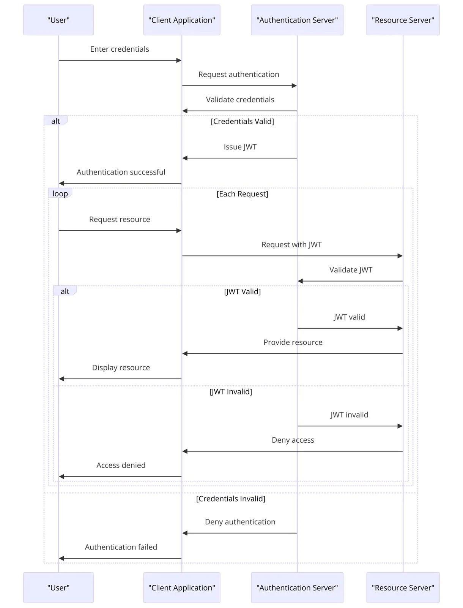

# Microservice Architecture Boilerplate

## Overview

This repository aims to implement the most common patterns for microservices and tackle a few of the issues that might arise. These implementations draw inspiration from the book _Designing Data-Intensive Applications_.

Initially, this set of microservices is designed to explore and experiment with:
- **Asynchronous Messaging:** Efficient communication between services
- **Observability:** Improved system monitoring and logging
- **Chaos Engineering:** Testing the system’s resilience under unexpected conditions
- **Authentication Methods:** Evaluation of various secure access mechanisms

The architecture undergoes stress testing under constrained processing power to push its resilience and efficiency to the limits.

---

## How to Build

### Build Docker Images

#### API Gateway
To build the Docker image for the API Gateway, run:
```bash
docker build -t api-gateway ./api-gateway
```

### Installing Helm Packages

#### Check Existing Ingress
Verify if an ingress controller is already running:
```bash
kubectl get pods -n ingress-nginx
```

#### Install Ingress if Necessary
If the ingress controller is not running, install it using Helm:
```bash
helm repo add ingress-nginx https://kubernetes.github.io/ingress-nginx
helm repo update
helm install ingress-nginx ingress-nginx/ingress-nginx --namespace ingress-nginx --create-namespace
```

#### Install Helm Dependencies
Build the Helm chart dependencies:
```bash
helm dependency build
```

#### Configure DNS
Add the following entry to your `/etc/hosts` file:
```bash
127.0.0.1 msa.local
```

#### Install Helm Chart
Deploy the Helm chart with:
```bash
helm install msa-services ./msa-services
```

### Notes
- Ensure Kubernetes and Helm are properly installed and configured.
- Modify the DNS entry to match your environment if needed.
- Monitor resource usage to observe system behavior under stress conditions.

---

## Authentication Server Workflow

Here's a breakdown on how the authentication workflow should operate.


